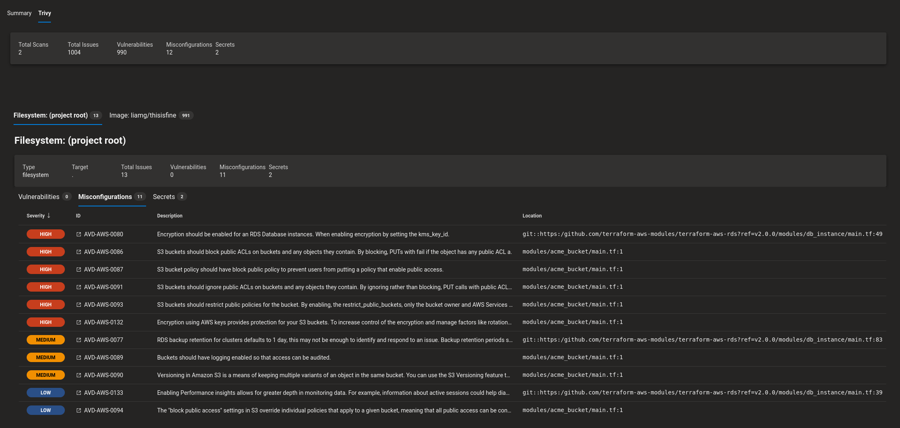

# trivy

An Azure DevOps Pipelines Task for [Trivy](https://github.com/aquasecurity/trivy), with an integrated UI.



## Installation

1. Install the Trivy task in your Azure DevOps organization (hit the `Get it free` button above).

2. Add the task to your `azure-pipelines.yml` in a project where you'd like to run trivy:

```yaml
- task: trivy@1
```

## Configuration

You can supply several inputs to customise the task.

| Input     | Description                                                                                                                          |
|-----------|--------------------------------------------------------------------------------------------------------------------------------------|
| `version` | The version of Trivy to use. Currently defaults to `latest`.                                                                         |
| `docker`  | Run Trivy using the aquasec/trivy docker image. Alternatively the Trivy binary will be run natively. Defaults to `true`.             |
| `debug`   | Enable debug logging in the build output.                                                                                            |
| `path`    | The path to scan relative to the root of the repository being scanned, if an `fs` scan is required. Cannot be set if `image` is set. |
| `image`   | The image to scan if an `image` scan is required. Cannot be set if `path` is set.                                                    |

### Example of scanning multiple targets

```yaml
trigger:
- main

pool:
  vmImage: ubuntu-latest

jobs:
- job: Scan the local project
  steps:
  - task: trivy@1
    inputs:
      path: .
- job: Scan the ubuntu image
  steps:
  - task: trivy@1
    inputs:
      image: ubuntu
```
